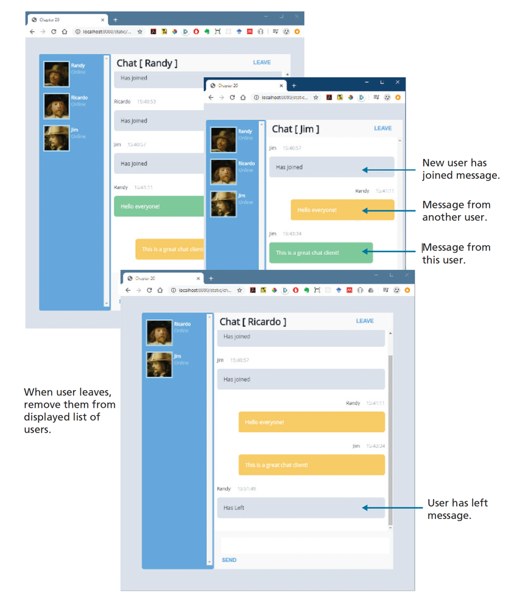

# In-class Server JS Activity 005
## Groups for this activity
Check canvas, groups are the same as Activity 004.
## Forking this repo (BLAH BLAH BLAH ... the same verbiage as earlier)
To work on this project, you will need to create a personal copy of the repository. This is done by forking it. Follow these steps:
### 1. Fork repository
- Click the “Fork” button located in the upper right corner of the repository page.
- This will create a copy of the repository under your GitHub account. (only one in the project will do this!)
### 2. Clone Your Fork
- On your GitHub account, navigate to your forked repository.
- Clone the forked repository to your local machine.
### 3. Adding Collaborators
- Add your project members in the same way as you would for a normal repository.
- Go to `Settings`, `Collaborators` to add members to this repo.
### 4. New branch
- ***VERY IMPORTANT*** -> Create a new branch before you make any changes to the forked repo!!
- Once the branch is created, make the changes as per project requirements.
- You can make as many commits and as many pushes as needed to that branch that was newly created.
- To be consistent, use the same styling for commit messages that was given in the Project I.
    - [Prefix] – [Short description of the change]
      The following are the only possible options for [Prefix]:
    - FEAT - For new features or major additions to the project.
        - Example: `FEAT - Added contact form to the Contact page`
    - FIX - For bug fixes, corrections, or revisions to the code.
        - Example: `FIX - Corrected navigation bar alignment on mobile devices`
    - STYLE - For stylistic changes such as formatting, CSS modifications, or minor visual updates.
        - Example: `STYLE - Updated color scheme for better contrast`
    - DOCS - For changes or additions to the documentation, including README files and comments in the code.
        - Example: `DOCS - Added project description and setup instructions to README`
    - SECURITY - For changes related to improving the security of the website.
        - Example: `SECURITY - Implemented input validation for contact form`
    - REFACTOR - For code refactoring that doesn’t change functionality but improves code quality or organization.
        - Example: `REFACTOR - Organized CSS files and cleaned up redundant styles`
    - TEST - For adding tests or making changes to the testing suite.
        - Example: `TEST - Added validation tests for contact form input`

### 5. Submitting your work
Once, you are sure that all the work is completed, go through the following steps for submission.
- Go to your forked repository on GitHub.
- Click on the “Pull requests” tab and then the “New pull request” button.
- Select the branch you pushed your changes to.
- Click “Create pull request” and provide a title and description for your changes.
- Submit the pull request.
- If you have made a pull request on error or have made further changes to the branch, you can always close the pull request that was made and make a new pull request.
- The closest pull request to the due date will be reviewed.

### 6. Grading and Feedback
- After the submission deadline, your pull request will be reviewed.
- Feedback and grades will be provided based on the changes made and the quality of the work.

Not sure, how to create a pull request, check this [link](https://docs.github.com/en/pull-requests/collaborating-with-pull-requests/proposing-changes-to-your-work-with-pull-requests/creating-a-pull-request-from-a-fork).

# Project description
In this project, you will create a chat application using nodeJS as your server-side framework.
Unlike the previous activities, you are making everything from scratch, which means the implementation and design are open-ended.
1. Use `npm init` to set up the folder, and `npm install` to add express. You would not need to do install express if you are forking this repository, as the necessary `package.json` already includes the `express` modules.
    The `init` will automatically install express.
2. Create a simple HTML file (`chat-client.html`). You will be writing code in `chat-client.js`
   to programmatically generate the markup based on the reception of messages
   from the server. Usually all the client related documents are placed in `public` folder. The server 
    related files are placed directly in the project folder and in our case that will in the `InclassServerJSActivity005` folder.
3. Your server code will need to maintain a list of user objects. In order to store the users as objects, create a class called
    `user`. You will need to save the name of the user and a random number (minimum variables in the `user` class), which should be a
   in the range of (1-100). This number will be used by the chat client
   to display a profile picture from https://randomuser.me/api/portraits/men/90.jpg or https://randomuser.me/api/portraits/women/45.jpg
   Your server code will also have to emit the updated user list to all clients
   whenever a new user is added. On the client side, when it receives a message
   from the server that there is a new user, it should display a message and then
   regenerate the list of users in the left side of chat using the passed user list
   data.
4. Your chat client has a Leave button. When the user clicks this button, it
   should send a message to the server that this user has left and then hide the
   chat window. The server should then remove the user from its list, and then
   emit a message to all clients of this action and provide an updated user list.
   The remaining clients should display a message and then regenerate the list of
   users in the left side of chat using the passed user list data.
5. The chat client has a textbox and a Send button. When the Send button is
   clicked, it should display the message directly in the chat window and then
   send the message to the server. The server, when it receives a new message,
   should broadcast it out to all the other clients (but not to the one that
   generated the message). The other clients should display the `message content`,
   `the user that created it`, and `the current time`.
6. The chat client can thus display **FOUR** types of messages in the chat window:
   1. a user joined message
   2. a user has left message
   3. another user’s chat message, and 
   4. the current user’s chat message. 
7. Create CSS classes for each of the above 4 classes, so that the messages are differentiable visually as well.
8. Test by opening multiple windows with different user names. Sending messages
and leaving should work appropriately and use the below figure as a reference. **You are not making an exact copy, but something similar.**

## Tips and Suggestions
* Start small: Break this problem down into smaller steps. First verify the globals are being read properly in the PHP file.
* You may decide to move your code into classes within your module after you
  finished your code, or you may decide to work with classes and modules right
  from the start.
* **DON’T USE ABSOLUTE PATHS**. Use only relative paths in your project files. This practice is particularly important when multiple people are working on the same project, as it ensures that links and references work correctly across different environments and systems.
* Iterate and Test: Continuously test your website after making necessary changes.
* Issues: Use the GitHub to create Issues and track the status of the issues using Milestones.
* Focus on Details: Pay attention to small details like spacing, hover effects, to create a polished final product.